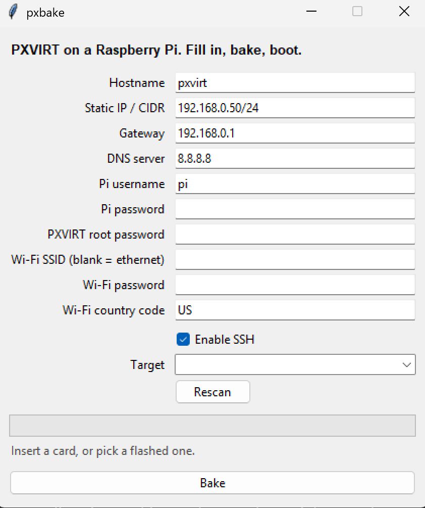
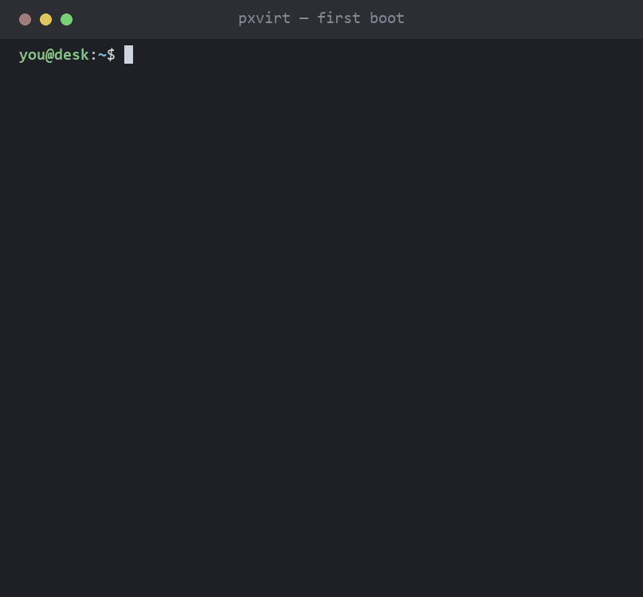

# pxbake

**Bake PXVIRT — Proxmox VE for ARM — into a Raspberry Pi SD card.**

Pick a card. Fill in the form. Hit Bake. It downloads Raspberry Pi OS Lite,
writes it to the card, and leaves behind a first-boot script that turns the Pi
into a working hypervisor node — static IP, Wi-Fi, user, bridge, root password,
the lot — without you ever opening an SSH session.



Come back in half an hour and there's a login page at `https://<your-ip>:8006`.



<sup>The window above is a real screenshot. The terminal is a
[termshot](https://github.com/sp00nznet/termshot) rendering — that half is a
30-minute unattended install on hardware that reboots twice and rewrites its own
network config, which does not screen-record. The commands in it are the ones
`stage2_sh()` emits; diff them against the source if you want.</sup>

## Use it

1. Plug in an SD card or USB reader.
2. Run `pxbake.exe` (or `python pxbake.py`).
3. Fill in the form, pick an **Image** and your card under **Target**, hit **Bake**.
4. Eject, boot the Pi, wait. Long coffee — it's an `apt upgrade` plus a full
   virtualisation stack, over an SD card.
5. `https://<your-ip>:8006`, user `root`, realm **Linux PAM**.

It walks the five steps down the middle of the window — get the image, erase,
write, configure, verify — ticking each off as it goes, so a long download or a
slow card looks like progress rather than a hang.

### Images

Four official Raspberry Pi OS builds, or your own file:

| Choice | Notes |
| --- | --- |
| Lite 64-bit (Trixie) | Newest. Pairs with PXVIRT 9. |
| Lite 64-bit (Bookworm) | PXVIRT 8 — a much larger arm64 package set. |
| Desktop 64-bit (Trixie / Bookworm) | If you want a GUI on the node too. |
| `Local file…` | Any `.img` or `.img.xz` you already have. |

All arm64, deliberately: PXVIRT has no 32-bit build, so listing an armhf image
would only be a guaranteed failure three reboots later. Downloads are
checksum-verified against the official `.sha256`, cached, and resumed if the
connection drops.

### Settings

**Save settings** writes the form to `settings.json` next to the image cache, and
it's reloaded next launch — so the second card doesn't mean retyping your subnet.
Baking saves it too.

**Passwords are never written.** Not the Pi user's, not root's, not the Wi-Fi
key, not the cluster peer's. Saving to skip a bit of typing isn't worth
plaintext credentials sitting on disk indefinitely; the four password fields
start empty every launch. Everything else — hostname, addressing, username,
Wi-Fi SSID, cluster peer, image choice, SSH toggle — comes back.

Already flashed a card yourself? Its boot partition shows up in **Target** too,
and picking it writes the config only — no download, no erase, two seconds.

**Joining an existing cluster?** Fill in **Cluster peer IP** and that node's root
password and the Pi joins itself on the third boot, once PXVIRT is up and the
bridge is settled. Leave it blank for a standalone node. See
[cluster join](#cluster-join) for the caveats — there are some.

**It will erase the disk you point it at.** Only USB, SD and MMC devices are ever
listed, and anything Windows marks as a system or boot disk is filtered out
before you see it, so your internal drives can't appear in the dropdown. You
still get a confirmation naming the model and size. Raw disk writes need
Administrator; the `.exe` asks for it on launch.

## Standing on

The route this automates was worked out by other people, and they wrote it down:

- **[Pimox on Pi 4 and 5](https://gist.github.com/enjikaka/52d62c9c5462748dbe35abe3c7e37f9a)**
  by [enjikaka](https://github.com/enjikaka) — the thirteen-step gist that got a
  lot of us our first ARM Proxmox node.
- **[Install Proxmox on Raspberry Pi](https://itsfoss.com/install-proxmox-raspberry-pi/)**
  at It's FOSS — clearer on keyring hygiene and the firmware package.
- **[PXVIRT](https://github.com/jiangcuo/pxvirt)** by
  [jiangcuo](https://github.com/jiangcuo) and Lierfang — the actual port. None of
  this exists without it. Their
  [docs](https://docs.pxvirt.lierfang.com/en/installfromdebian.html) are the
  reference this follows.

### What's different here

Mostly: it's newer, and it's unattended.

- **New home for the packages.** Proxmox-Port became PXVIRT, and the old
  `pveport` repo on `apqa.cn` was retired along with the rename — both hosts are
  down now. pxbake pulls from `mirrors.lierfang.com/pxcloud/pxvirt`, the current
  one.
- **Bookworm or Trixie.** The codename comes from `$VERSION_CODENAME` in
  `/etc/os-release`, so whichever Raspberry Pi OS you flashed lines up with the
  matching PXVIRT suite. Latest RPi OS Lite is Trixie → PXVIRT 9.
- **Keyring, not `trusted.gpg.d`.** `signed-by=` scopes the key to this one repo.
- **A 4K-page kernel.** The Pi 5 boots `kernel_2712.img` with 16K pages; PXVIRT
  wants 4K. pxbake adds `kernel=kernel8.img` to `config.txt`, under a fresh
  `[all]` so a trailing model filter can't swallow it.
- **cgroups on.** `cgroup_enable=cpuset cgroup_enable=memory cgroup_memory=1` in
  `cmdline.txt`, or every LXC container reports zero memory and CPU.
- **NetworkManager, not dhcpcd.** Bookworm dropped dhcpcd, so the static IP goes
  in as an NM keyfile.
- **`upgrade`, not `full-upgrade`.** `upgrade` never removes a package, which
  keeps the Pi's own kernel where it is with a PXVIRT repo enabled.
- **The bridge goes last.** Swapping `/etc/network/interfaces` is the step that
  locks you out mid-session. Here it's written at the end of an unattended run,
  and the Pi reboots straight into it.
- **`pve-edk2-firmware-aarch64`** for UEFI guest boot, per It's FOSS.
- **Nothing typed twice.** Postfix's prompt is preseeded, the root password is
  set non-interactively, and the whole thing runs off a card you eject once.

## How it works

Four files land on the boot partition:

| File | Why |
| --- | --- |
| `firstrun.sh` | Stage 1: hostname, `/etc/hosts`, user, Wi-Fi, static IP. |
| `cmdline.txt` | Gets the cgroup args, plus `systemd.run=` to fire stage 1 once. |
| `config.txt` | Gets `kernel=kernel8.img` under a fresh `[all]`. |
| `ssh` | The magic empty file that turns on sshd. |

Stage 1 also installs `pxbake-install.service`, which fires on the **second**
boot once the network is genuinely up and does the heavy half: keyring, repo,
`ifupdown2`, `proxmox-ve` and friends, `vmbr0`, the network handover, the root
password. Then it deletes itself and reboots.

Two stages because stage 1 runs in a stripped-down boot target with no network.
Trying to `apt install proxmox-ve` there is how you get a brick.

### Cluster join

Give it a peer IP and root password and there's a third stage,
`pxbake-cluster.service`, which runs `pvecm add <peer> --use_ssh 1` on the boot
*after* the install. Three deliberate choices in there:

- **Third boot, not second.** `pvecm add` registers the node under whatever
  address it holds at the time. Run it before the `vmbr0` handover and the
  cluster records a link that stops existing a minute later. The unit is
  `After=pxbake-install.service`, and since stage 2 ends in a reboot it simply
  never gets its turn until the install is done.
- **`ssh-keyscan` first.** `pvecm` shells out to `ssh`, which refuses to proceed
  on an unknown host key and would otherwise hang forever with no output.
- **`sshpass`.** `pvecm` prompts for the peer's root password on a tty. The only
  alternative is authorising an SSH key on the peer beforehand, which pxbake has
  no way to do from a card. The password is written `umask 077` to
  `/root/.pxbake-peer-pw` and `shred`ed on success; on failure it stays for the
  retry, so a peer password you care about is a peer password you should rotate
  after.

The unit carries `ConditionPathExists=!/etc/pve/corosync.conf`, so it no-ops the
moment the node is in a cluster, and retries on the next boot if the join failed.
`/var/log/pxbake-cluster.log` has the `set -x` trace either way.

Two things it can't paper over. A node must be **empty** to join — fine for a
fresh bake, fatal if you add VMs first. And joining a **stock x86 Proxmox VE**
cluster is not something PXVIRT promises; mixed-architecture clustering is
advertised between PXVIRT nodes. Same-major-version PXVIRT peers are the
supported path.

This is the one part of pxbake that hasn't been exercised at all — I have no
second node to join. Treat it as a well-formed first attempt, watch the log.

Going sideways? `/boot/firmware/pxbake-stage1.log` and
`/var/log/pxbake-install.log` on the Pi. Both are `set -x`, so they're loud.

## Things worth knowing

**Wi-Fi Pis get a port-less bridge.** A Wi-Fi link in *client* mode can't carry
other devices' MAC addresses: infrastructure data frames have three address
fields — receiver, transmitter, destination — and no room for "original source",
so the AP can't learn about a MAC hiding behind an associated station or route
replies back to it. AP mode bridges fine (that's the normal hostapd setup); it's
the client side that can't. So on Wi-Fi the Pi's IP stays on `wlan0` under
NetworkManager and `vmbr0` comes up with `bridge-ports none` — web UI fine, VMs
on an island.

The real escape hatch is 4-address mode: `iw dev wlan0 set 4addr on` adds the
fourth address field and makes client-side bridging work, but the AP has to
support WDS too and most consumer routers don't. If yours does, set 4addr and put
`wlan0` in `bridge-ports`. Otherwise, use Ethernet.

**Ethernet hands the network over completely.** Stage 2 deletes the NM profile
and disables NetworkManager so `ifupdown2` owns `vmbr0` alone. Two daemons
fighting over one interface is exactly the 3am page this tool exists to prevent.

**Your passwords ride on the card in plaintext, briefly.** They sit in
`firstrun.sh` until first boot, which deletes it. `crypt` left the Python
standard library in 3.13 and hashing them properly means a dependency for one
function. If someone can read your card before its first boot you have a larger
problem — but now you know about this one.

**It's a third-party repo run by one company.** Lierfang, not Proxmox GmbH.
That's the deal ARM virtualisation comes with; there's no official option.

## Running and building

Python 3.10+ with Tk — every python.org install, every Windows install.
`pip install` nothing. One file, standard library only.

```
python pxbake.py
python pxbake.py --selftest
```

```powershell
.\build_win32.ps1     # -> dist\pxbake.exe, ~11 MB, no Python needed
```

Or take a prebuilt one from
[Releases](https://github.com/sp00nznet/pxbake/releases). CI runs that same
script on every push, so the published binary and a local build come from one
definition rather than two that can drift. Cutting a release is just a tag:

```bash
git tag v0.1.0 && git push origin v0.1.0
```

PyInstaller is the only build-time dependency and it never ships inside the tool.
The script builds in a local `.venv\` on purpose: PyInstaller flat-refuses to run
if the obsolete `pathlib` backport is installed anywhere on the path, and plenty
of machines have it lying around. A clean venv can't. It also passes
`--uac-admin`, so the exe asks for elevation up front instead of failing deep
into a bake.

`docs/demo.py` regenerates the GIF; it wants `pillow` and `termshot.py` beside it.

## Tests

`--selftest` runs the generator against a fake boot partition and asserts on the
result: secrets survive shell quoting, Wi-Fi and Ethernet produce different
bridges, the retired mirror is gone, `[all]` precedes `kernel=`, a system disk
never survives the target filter, and baking twice doesn't stack duplicate kernel
arguments.

That last one isn't hypothetical. An early version quietly appended
`systemd.unit=kernel-command-line.target` a second time on re-run, and its cleanup
`sed` didn't strip it either — which would have left the Pi rebooting into a bare
systemd target, forever, with no console message explaining why. The assert found
it before any hardware did.

## Targets

Raspberry Pi 4 and 5, Raspberry Pi OS Lite 64-bit. Pi 3 works per the PXVIRT
hardware notes, though 4 GB of RAM is the realistic floor. Older Pis are ARMv7 —
no.

The generator is covered by `--selftest` and every command it emits traces to the
PXVIRT docs. It has not yet been through a full hardware run, so keep a monitor
on the Pi for the first one and read the two logs.

## Licence

MIT — see [LICENSE](LICENSE). pxbake only *generates* shell scripts and writes an
unmodified Raspberry Pi OS image; it contains no PXVIRT or Proxmox code, so
nothing here is a derivative work of their AGPL. What it installs on the Pi
remains under its own licences.

Not affiliated with Proxmox Server Solutions GmbH, Lierfang, or Raspberry Pi Ltd.
Proxmox® is a registered trademark of Proxmox Server Solutions GmbH.
